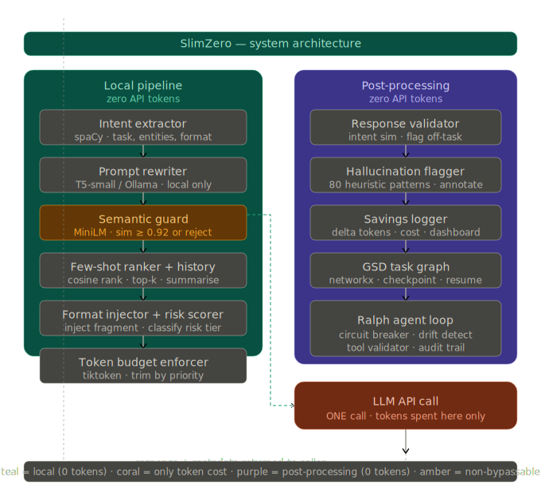
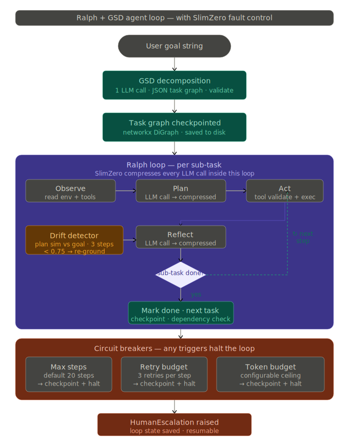
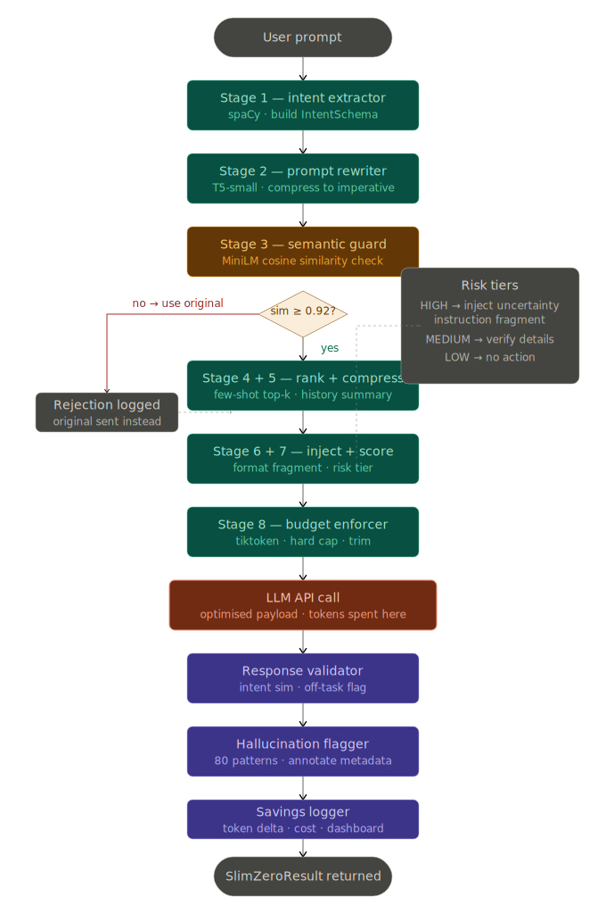

# SlimZero

**Zero-overhead token compression for LLM APIs.**

SlimZero sits between your app and any LLM — Claude, GPT-4, Gemini, Ollama — and quietly makes every call cheaper, faster, and less likely to hallucinate. It rewrites your prompts locally, tells the model to respond concisely, and validates the response, all without spending a single token doing it.

```python
from slimzero import SlimZero

sz = SlimZero(model="claude-sonnet-4-6")
response = sz.call("Can you please maybe explain what gradient descent is in simple terms?")
# → internally rewrites to: "Explain gradient descent simply."
# → appends: "One paragraph max. No summary."
# → hits API once
# → saved 31 input tokens, ~55 output tokens estimated
```

---

## Why SlimZero?

Every other token optimisation tool — LangChain optimisers, DSPy, LLMLingua — burns API tokens to optimise your prompts. SlimZero does all of that locally. The API is called exactly once, for your actual query, never for the optimisation work itself.

| Tool | Meta-token cost | Hallucination guard | Agent fault control | Drop-in? |
|---|---|---|---|---|
| LangChain optimiser | HIGH | None | None | No |
| DSPy | HIGH | None | None | No |
| LLMLingua | Low | None | None | Partial |
| **SlimZero** | **Zero** | **Built-in** | **Full** | **Yes** |

---

## What it does

### 1. Compresses your prompt locally
Strips filler words, merges redundant clauses, converts hedged phrasing to direct instructions. Uses a local T5-small model — never the target API.

### 2. Pre-conditions minimal responses
Appends a tiny system instruction fragment (under 12 tokens) that tells the LLM to skip preamble, not restate the question, and answer only what was asked. This happens before the API call, not after — so you pay for fewer output tokens too.

### 3. Guards against hallucinations
Classifies your query by risk level locally — dates, numbers, citations are HIGH risk; open-ended questions are LOW. High-risk queries get an uncertainty instruction appended. After the response arrives, a local validator checks it actually addressed your question.

### 4. Runs a full autonomous agent loop
Built-in Ralph loop + GSD task graph for long-horizon goals. Decomposes goals into checkpointed sub-tasks, applies compression on every agent step, and includes circuit breakers, semantic drift detection, and tool-call validation. No runaway loops, no silent failures.

### 5. Tracks everything
A live savings dashboard shows tokens saved per call, cumulative cost reduction, which stages fired, and hallucination flags — exportable as JSON.

---

## Architecture Diagrams

### System Architecture



### Agent Loop (Ralph + GSD)



### Request Flowchart



---

## Installation

```bash
pip install slimzero
```

Optional extras:

```bash
pip install slimzero[agent]      # Ralph loop + GSD task graph
pip install slimzero[dashboard]  # Rich live terminal dashboard
pip install slimzero[all]        # Everything
```

---

## Quick start

### Basic call

```python
from slimzero import SlimZero

sz = SlimZero(model="claude-sonnet-4-6")
result = sz.call("Explain what a transformer model is in detail please.")

print(result.response)       # LLM response
print(result.input_token_savings_percent)   # e.g. 38%
print(result.flags_raised)          # hallucination flags, if any
```

### With an existing client

```python
import anthropic
from slimzero import SlimZero

client = anthropic.Anthropic()
sz = SlimZero(api_client=client, model="claude-opus-4-6")

result = sz.call("Write a Python function to reverse a linked list.")
```

### Multi-turn conversation

```python
sz = SlimZero(model="gpt-4o", history_window=4)

result1 = sz.call("What is gradient descent?")
result2 = sz.call("Now give me a Python example.")
# Old turns are auto-compressed. Recent turns stay verbatim.
```

### Autonomous agent mode

```python
from slimzero import SlimZero

sz = SlimZero(
    model="claude-opus-4-6",
    agent_mode=True,
    max_agent_steps=30,
    dashboard=True
)

result = sz.run_goal(
    goal="Research the top 5 open-source vector databases and write a comparison report.",
    tools=[search_tool, write_tool, read_tool]
)

print(result.output)        # Final result
print(result.audit_trail)   # Every tool call logged
print(result.total_tokens_saved)
```

---

## Comprehensive Examples

### Web Framework Integration

#### Flask API

```python
from flask import Flask, request, jsonify
from slimzero import SlimZero

app = Flask(__name__)
sz = SlimZero(model="gpt-4o")

@app.route("/chat", methods=["POST"])
def chat():
    data = request.json
    result = sz.call(
        prompt=data["message"],
        system_prompt=data.get("system", "You are a helpful assistant.")
    )
    return jsonify({
        "response": result.response,
        "savings_percent": result.input_token_savings_percent,
        "flags": result.flags_raised
    })

if __name__ == "__main__":
    app.run(debug=True)
```

#### FastAPI API

```python
from fastapi import FastAPI, HTTPException
from pydantic import BaseModel
from slimzero import SlimZero

app = FastAPI()
sz = SlimZero(model="gpt-4o")

class ChatRequest(BaseModel):
    message: str
    system: str | None = "You are a helpful assistant."

class ChatResponse(BaseModel):
    response: str
    savings_percent: float
    flags: list[str]

@app.post("/chat", response_model=ChatResponse)
async def chat(req: ChatRequest):
    result = sz.call(prompt=req.message, system_prompt=req.system)
    return ChatResponse(
        response=result.response,
        savings_percent=result.input_token_savings_percent,
        flags=result.flags_raised
    )
```

#### LangChain Agent

```python
from langchain_openai import ChatOpenAI
from slimzero import SlimZero

llm = ChatOpenAI(model="gpt-4o")
sz = SlimZero(api_client=llm, model="gpt-4o")

def slimzero_llm(prompt: str) -> str:
    result = sz.call(prompt=prompt)
    return result.response

# Use slimzero_llm as your LLM in LangChain chains
```

### CLI Tool

```python
#!/usr/bin/env python3
"""SlimZero CLI - Compress prompts from the command line."""

import argparse
import sys
from slimzero import SlimZero

def main():
    parser = argparse.ArgumentParser(description="SlimZero - Zero-overhead token compression")
    parser.add_argument("prompt", nargs="*", help="Prompt to compress")
    parser.add_argument("--model", "-m", default="gpt-4o", help="Model to use")
    parser.add_argument("--compare", "-c", action="store_true", help="Show before/after comparison")
    
    args = parser.parse_args()
    
    if not args.prompt:
        print("Enter a prompt:", end=" ")
        prompt = sys.stdin.read().strip()
    else:
        prompt = " ".join(args.prompt)
    
    sz = SlimZero(model=args.model)
    result = sz.call(prompt)
    
    if args.compare:
        print(f"\n📝 Original ({result.original_tokens} tokens):")
        print(f"   {result.original_prompt}")
        print(f"\n✨ Compressed ({result.sent_tokens} tokens):")
        print(f"   {result.sent_prompt}")
        print(f"\n💰 Savings: {result.input_token_savings_percent:.1f}%")
    else:
        print(result.response)
    
    if result.flags_raised:
        print(f"\n⚠️  Flags: {result.flags_raised}")

if __name__ == "__main__":
    main()
```

### Batch Processing

```python
from slimzero import SlimZero
from concurrent.futures import ThreadPoolExecutor

sz = SlimZero(model="gpt-4o")

prompts = [
    "Please could you explain what machine learning is?",
    "Can you maybe give me an example of recursion?",
    "I was wondering if you could help me understand Python lists?",
    "What is the difference between a stack and a queue?",
    "Could you possibly explain what an API is?",
]

def process_prompt(prompt: str) -> dict:
    result = sz.call(prompt)
    return {
        "prompt": prompt,
        "response": result.response,
        "savings_percent": result.input_token_savings_percent
    }

with ThreadPoolExecutor(max_workers=5) as executor:
    results = list(executor.map(process_prompt, prompts))

# Summary
total_savings = sum(r["savings_percent"] for r in results)
print(f"Average savings: {total_savings / len(results):.1f}%")
```

### Streaming Responses

```python
from slimzero import SlimZero

sz = SlimZero(model="gpt-4o")

result = sz.call(
    prompt="Write a detailed explanation of how async/await works in Python.",
    stream=True
)

for chunk in result.stream:
    print(chunk, end="", flush=True)
```

### Custom Plugins

```python
from slimzero.plugins import BaseStage, StageInput, StageOutput

class MarkdownFormatter(BaseStage):
    """Ensure responses are formatted as markdown."""
    name = "markdown_formatter"
    
    def process(self, inp: StageInput) -> StageOutput:
        new_prompt = inp.prompt + "\n\nFormat your response in markdown."
        return StageOutput(prompt=new_prompt, modified=True, notes="added markdown instruction")

sz = SlimZero(
    model="gpt-4o",
    extra_stages=[MarkdownFormatter()]
)

result = sz.call("Explain Python decorators")
```

### Conversation with History

```python
from slimzero import SlimZero

sz = SlimZero(
    model="gpt-4o",
    history_window=5,  # Keep last 5 turns verbatim
    hallucination_guard=True
)

# First turn
result1 = sz.call("What is gradient descent?")
print(result1.response)

# Second turn - history is managed automatically
result2 = sz.call("Show me a Python example.")
print(result2.response)

# Check compression stats
print(f"History turns: {len(result2.conversation_history)}")
print(f"Compressed history: {result2.history_was_compressed}")
```

### JSON Structured Logging

```python
from slimzero import SlimZero

sz = SlimZero(
    model="gpt-4o",
    log_file="slimzero_sessions.jsonl"
)

# Each call appends structured JSON to the log file
result = sz.call("Explain quantum entanglement")

# Or read the log
import json
with open("slimzero_sessions.jsonl") as f:
    for line in f:
        entry = json.loads(line)
        print(f"Call {entry['call_id']}: {entry['savings_percent']}% saved")
```

### Dashboard Mode

```python
from slimzero import SlimZero

sz = SlimZero(
    model="gpt-4o",
    dashboard=True  # Rich live terminal dashboard
)

# Run several calls and watch the dashboard update
for topic in ["Python", "Rust", "Go", "JavaScript"]:
    result = sz.call(f"Explain {topic} in one paragraph.")
    print(f"\n{topic}: {result.response[:100]}...")
```

---

## How the pipeline works

Every call passes through 8 local stages before hitting the API, then 3 local stages after.

```
User prompt
    │
    ▼
┌─────────────────────────────── LOCAL (0 tokens) ──────────────────────────────┐
│  Stage 1  Intent Extractor      spaCy · parse task, entities, format          │
│  Stage 2  Prompt Rewriter       T5-small · compress to imperative form        │
│  Stage 3  Semantic Guard ⚠     MiniLM · reject if similarity < 0.92           │
│  Stage 4  Few-Shot Ranker      cosine sim · keep top-k examples               │
│  Stage 5  History Compressor   T5-small · summarise old turns                │
│  Stage 6  Format Injector     rule engine · append response fragment          │
│  Stage 7  Hallucination Scorer heuristics · classify risk · inject if HIGH   │
│  Stage 8  Budget Enforcer      tiktoken · hard cap · trim by priority          │
└───────────────────────────────────────────────────────────────────────────────┘
    │
    ▼
┌─────────────────────────── API CALL (tokens spent) ───────────────────────────┐
│  Target LLM — optimised payload only                                          │
└───────────────────────────────────────────────────────────────────────────────┘
    │
    ▼
┌─────────────────────────────── LOCAL (0 tokens) ──────────────────────────────┐
│  Post 1   Response Validator    MiniLM · check reply addresses intent          │
│  Post 2   Hallucination Flagger 80 heuristic patterns · annotate metadata     │
│  Post 3   Savings Logger       token delta · cost · cumulative dashboard       │
└───────────────────────────────────────────────────────────────────────────────┘
    │
    ▼
SlimZeroResult (response + metadata + savings)
```

**Stage 3 is the only non-bypassable stage.** If the rewrite changes meaning (similarity drops below 0.92), the original prompt is sent instead. Savings never come at the cost of correctness.

---

## Configuration

```python
sz = SlimZero(
    model="claude-sonnet-4-6",      # any OpenAI-spec model string
    api_client=None,                 # pass existing client, or SlimZero creates one
    token_budget=4096,              # hard token ceiling for outbound prompt
    sim_threshold=0.92,             # semantic guard threshold (min 0.80)
    few_shot_k=3,                  # max few-shot examples to keep
    history_window=4,               # recent turns kept verbatim
    hallucination_guard=True,       # enable risk scoring + uncertainty injection
    response_validation=True,       # enable post-response intent check
    agent_mode=False,               # enable Ralph loop + GSD
    max_agent_steps=20,            # circuit breaker: max steps
    max_retries=3,                 # circuit breaker: retries per sub-task
    drift_threshold=0.75,           # semantic drift detection threshold
    dashboard=False,                # Rich live terminal dashboard
    log_file=None,                 # path for JSON structured log
)
```

---

## Fault prevention

SlimZero is built around eight layered defences:

| Layer | Mechanism | Response |
|---|---|---|
| L1 Input validation | Schema check on every call | Raise `SlimZeroInputError` |
| L2 Semantic gate | Cosine similarity post-rewrite | Reject rewrite, use original |
| L3 Budget enforcer | Token count check | Trim in priority order |
| L4 Response gate | Intent similarity post-call | Flag `OFF_TASK` with warning |
| L5 Hallucination flag | Heuristic pattern scan | Annotate response metadata |
| L6 Circuit breaker | Step/retry/token budget | Halt loop, checkpoint state |
| L7 Drift detector | Plan embedding divergence | Re-ground agent, halt if re-drifts |
| L8 Tool validator | Argument schema check | Reject call, return structured error |

Three rules that never change:

- SlimZero **never suppresses** an LLM response. Flags are metadata — the response always reaches your code.
- SlimZero **never blocks** a request. If every stage fails, the original prompt is sent unchanged.
- The semantic guard **cannot be disabled** — only its threshold can be lowered (minimum 0.80).

---

## Agent mode — Ralph + GSD

`agent_mode=True` activates the full autonomous agent orchestration layer.

**GSD (Get-Shit-Done)** decomposes your goal into a directed graph of sub-tasks using one LLM call. Each sub-task is checkpointed — if the session dies, it resumes from where it left off.

**Ralph** runs each sub-task in an observe → plan → act → reflect loop. SlimZero applies the full compression pipeline to every LLM call inside the loop, so agent steps are as cheap as regular calls.

**Circuit breakers** halt the loop if any budget is exhausted (max steps, max retries, max tokens). State is always checkpointed before halting — no work is lost.

**Semantic drift detection** watches whether the agent's plan stays aligned with the original goal. If it diverges for three consecutive steps, it is re-grounded. If it diverges again, the loop halts.

---

## Plugin API

Every pipeline stage is a plugin. Add your own compressor without touching SlimZero's core:

```python
from slimzero.plugins import BaseStage, StageInput, StageOutput

class MyCompressor(BaseStage):
    name = "my_compressor"

    def process(self, inp: StageInput) -> StageOutput:
        new_prompt = your_compression_logic(inp.prompt)
        return StageOutput(prompt=new_prompt, modified=True, notes="custom compression")

sz = SlimZero(model="...", extra_stages=[MyCompressor()])
```

Plugins auto-discovered via Python entry points (`slimzero.stages` group). Community plugins installable as separate packages.

---

## Tech stack

| Library | Purpose |
|---|---|
| spaCy `en_core_web_sm` | Intent extraction |
| sentence-transformers `all-MiniLM-L6-v2` | Semantic guard + response validation |
| tiktoken | Token counting (all major models) |
| transformers + T5-small | Local prompt rewriter |
| Ollama Python client | Fallback local rewriter |
| networkx | GSD task graph |
| Rich | Live dashboard + logging |

---

## License

MIT — use it in anything.

---

*Built to solve a real problem: every token should do real work.*
